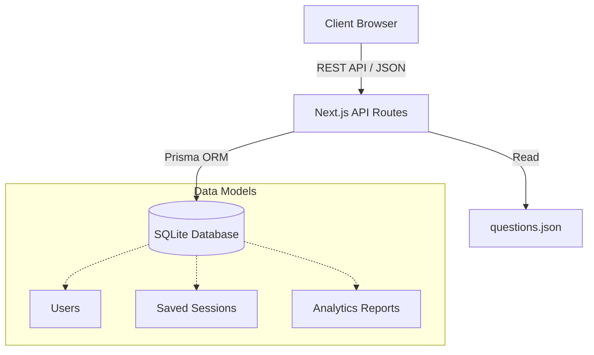

# 🎓 ExamForge (CSA Quiz App)


A premium, highly interactive exam preparation platform designed for the Certified System Administrator (CSA) certification. ExamForge provides a sleek, dark-themed learning environment featuring granular practice sessions, full-length timed simulations, and in-depth analytics reporting.

## ✨ Key Features

- **Practice Mode**: Focus on specific knowledge domains. Provides immediate feedback, correct answer highlighting, and detailed explanations for every question.
- **Test Mode**: A rigorous, simulated exam environment. Features customizable timers (1 min/question or unlimited), no immediate feedback, and a final comprehensive review.
- **In-Depth Analytics**: Post-exam reports break down performance by section, highlighting strong domains and weak areas requiring focus.
- **Persistent Progress**: Securely saves your exact position mid-exam so you can close the browser and resume right where you left off.
- **Premium UI/UX**: Built with a custom dark-mode design system, featuring micro-animations, dynamic SVG loaders, and responsive layouts.

## 🏗️ Architecture



## 🛠️ Tech Stack

- **Frontend**: Next.js 15 (App Router), React 19, Tailwind CSS
- **Icons**: Lucide React
- **Backend**: Next.js API Routes (Serverless ready)
- **Database**: SQLite (Development), Prisma ORM

## 🚀 Getting Started

### 1. Install Dependencies
```bash
npm install
```

### 2. Setup the Database
Initialize the SQLite database and generate the Prisma client:
```bash
npx prisma db push
npx prisma generate
```

### 3. Run the Development Server
```bash
npm run dev
```
Navigate to `http://localhost:3000` to view the application.
